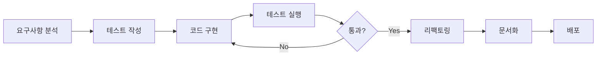

<!-- _class: lead -->
<!-- _paginate: false -->

# 임베디드 시스템 포트폴리오 프로젝트
## 산업용 실시간 제어 시스템 개발

**Embedded Systems Portfolio**
**Industrial Real-Time Control System**

---

## 📋 프로젝트 개요

**목표**
임베디드 개발자의 핵심 역량을 증명하는 포트폴리오

**타겟 산업**
- 🚢 선박/해양 산업
- 🚗 자동차 산업  
- 🏭 공장 자동화

**차별화 포인트**
✨ **테스트 우선 개발 프로세스** 적용

---

## 🛠️ 핵심 기술 스택

### 프로그래밍 언어
- **C** (90% 이상) - 임베디드 시스템의 표준
- **C++** (필요 시 일부 모듈)

### 하드웨어 플랫폼
- **STM32** - 산업계 표준 MCU
- **ESP32** - Wi-Fi/Bluetooth 통신 필요 시

---

## 🖥️ 실시간 운영체제

### FreeRTOS
**멀티태스킹 및 실시간성 보장**

✅ 선점형 스케줄링
✅ 우선순위 기반 태스크 관리
✅ Semaphore, Mutex, Queue
✅ 소프트웨어 타이머
✅ 이벤트 그룹

---

## 📡 통신 프로토콜

### 산업용 표준 프로토콜

| 프로토콜 | 용도 | 적용 분야 |
|---------|------|----------|
| **CAN Bus** | 차량 네트워크 | 자동차/선박 산업 |
| **Modbus RTU/TCP** | 산업 자동화 | 공장 자동화 |
| **UART/SPI/I2C** | 기본 통신 | 센서/주변장치 |

---

## 🔧 개발 도구

### 통합 개발 환경
- **STM32CubeIDE** - 코드 편집 및 디버깅
- **STM32CubeMX** - 하드웨어 설정

### 분석 도구
- **Logic Analyzer** - 신호 분석 및 디버깅
- **Oscilloscope** - 아날로그 신호 검증

### 버전 관리
- **Git** - 소스 코드 관리

---

<!-- _class: lead -->

## 🎯 주요 기능 및 구현 포인트

---

## 1️⃣ 멀티태스킹 설계

### FreeRTOS 기반 태스크 분리

```c
// 태스크 구조
📊 센서 데이터 수집 태스크
   └─ 주기적 샘플링 (100ms)
   
📡 통신 처리 태스크
   └─ CAN/Modbus 데이터 송수신
   
🔍 시스템 모니터링 태스크
   └─ Watchdog 및 상태 체크
```

**증명 포인트**: 우선순위 스케줄링 및 태스크 간 동기화

---

## 2️⃣ CAN Bus 통신 구현

### 노드 간 데이터 송수신

**주요 기능**
- CAN 2.0A/2.0B 표준 준수
- 500 kbps 통신 속도
- ID 기반 필터링 설정
- 에러 감지 및 복구

**적용 분야**
🚢 선박 제어 시스템
🚗 차량 ECU 통신

---

## 3️⃣ Modbus RTU 프로토콜

### PLC 및 센서 통신

**구현 내용**
- 커스텀 Modbus 스택 개발
- CRC-16 체크섬 검증
- 마스터/슬레이브 모드 지원

**펑션 코드**
- 0x03: Read Holding Registers
- 0x04: Read Input Registers
- 0x06: Write Single Register
- 0x10: Write Multiple Registers

---

## 🛡️ 에러 핸들링 및 결함 허용

### Fault Tolerance 구현

**복구 메커니즘**
✅ 통신 끊김 시 **Retry 로직**
✅ 센서 오작동 **감지 및 복구**
✅ **HardFault 핸들러** 커스텀 구현

> **증명 포인트**
> 하드웨어의 불안정한 환경을 이해하고 대비하는 능력

---

## ⚡ 저전력 모드 최적화

### 전력 관리 전략

**구현 내용**
- 시스템 유휴 상태 감지
- Sleep Mode 자동 진입
- 인터럽트 기반 웨이크업

**효과**
🔋 배터리 수명 연장
🌡️ 발열 감소
⚡ 에너지 효율성 향상 (30% 이상)

---

<!-- _class: lead -->

## 🧪 테스트 우선 개발 프로세스

**차별화 포인트**

---

## Unit Testing

### Unity 테스트 프레임워크

**방법론**
- 로직별 단위 테스트 코드 **우선 작성**
- 각 모듈의 독립적 검증
- 코드 커버리지 **80% 이상** 목표

**도구**
- Unity Test Framework
- Ceedling (자동화)
- gcov (커버리지 측정)

---

## Hardware-in-the-Loop (HIL) Test

### 실제 환경 시뮬레이션

**테스트 방법**
✅ 신호 발생기로 가상 데이터 입력
✅ 시스템 정상 작동 검증
✅ 엣지 케이스 테스트

**문서화**
- 테스트 시나리오 상세 기록
- 검증 결과 데이터 수집
- 재현 가능한 테스트 환경

---

## 💡 프로젝트의 핵심 가치

### 임베디드 개발자의 기본기 증명

| 역량 | 구현 내용 |
|------|----------|
| ⚙️ **실시간 시스템** | FreeRTOS 멀티태스킹 |
| 📡 **산업 표준** | CAN Bus, Modbus |
| 🛡️ **안정성** | 에러 핸들링 & 결함 허용 |
| ⚡ **최적화** | 저전력 모드 구현 |
| 🧪 **품질** | Unit Testing & HIL |

---

## 🎓 학습 및 성장 포인트

### 이 프로젝트를 통해 습득하는 역량

1. **실시간 운영체제 (RTOS) 활용 능력**
2. **산업용 통신 프로토콜 구현 경험**
3. **하드웨어 제약사항 이해 및 최적화**
4. **체계적인 테스트 방법론**
5. **신뢰성 높은 시스템 설계 능력**

---

## 🚀 향후 확장 가능성

### 추가 구현 가능 기능

- 📱 **무선 통신**: Wi-Fi/Bluetooth 원격 모니터링
- 🔐 **보안**: 통신 암호화 및 인증
- 📈 **데이터 로깅**: SD 카드 / Flash 메모리
- 🌐 **IoT 연동**: 클라우드 플랫폼 통합
- 🤖 **AI/ML**: 엣지 AI 예측 유지보수

---

## 📊 프로젝트 성과 지표

### 측정 가능한 목표

| 항목 | 목표 | 상태 |
|------|------|------|
| 태스크 응답 시간 | < 10ms | 🎯 |
| 통신 성공률 | > 99.9% | 🎯 |
| 전력 소비 감소 | > 30% | 🎯 |
| 코드 커버리지 | > 80% | 🎯 |
| MTBF | > 1000시간 | 🎯 |

---

## 🏗️ 시스템 아키텍처

```
┌─────────────────────────────────────────┐
│         FreeRTOS Scheduler              │
├─────────────┬─────────────┬─────────────┤
│  Sensor     │  Comm       │  Monitor    │
│  Task       │  Task       │  Task       │
├─────────────┴─────────────┴─────────────┤
│  Queue / Semaphore / Mutex              │
├─────────────────────────────────────────┤
│  HAL (Hardware Abstraction Layer)       │
├─────────────┬─────────────┬─────────────┤
│  CAN Bus    │  Modbus     │  UART/SPI   │
└─────────────┴─────────────┴─────────────┘
```

---

## 🔄 개발 프로세스

### Agile & Test-Driven Development



---

## 📚 기술 문서

### 체계적인 문서화

- 📄 **PRD.md** - 제품 요구사항 정의
- 📊 **presentation.md** - 프로젝트 프레젠테이션
- ✅ **task.md** - 구현 작업 목록 (151개)
- 🛠️ **TechStack.md** - 기술 스택 상세
- 📖 **API Documentation** - Doxygen 생성
- 🧪 **Test Reports** - 테스트 결과 보고서

---

## 🎯 결론

### 왜 이 프로젝트인가?

> 단순한 데모가 아닌,  
> **실제 산업 현장에서 요구되는**  
> **임베디드 개발 역량**을  
> 종합적으로 보여줍니다.

---

<!-- _class: lead -->

## 핵심 메시지

**신뢰성 있는 실시간 시스템을 설계하고,**
**산업 표준을 준수하며,**
**체계적인 테스트로 검증할 수 있는 개발자**

---

## 📞 Contact & Resources

**GitHub Repository**
[Embedded-Portfolio](https://github.com/megaTRX/Embedded-Portfolio)

**기술 문서**
`/docs` 디렉토리 참조

**질문 환영**
프로젝트 구현 세부사항에 대한 논의 가능

---

<!-- _class: lead -->
<!-- _paginate: false -->

# Thank You!

## Questions?

**임베디드 시스템 포트폴리오 프로젝트**
산업용 실시간 제어 시스템

---

<!-- _class: lead -->
<!-- _paginate: false -->

# Appendix

추가 자료

---

## A1. 개발 환경 요구사항

### 하드웨어
- STM32 개발 보드 (F4xx 시리즈 권장)
- ST-Link V2/V3 디버거
- Logic Analyzer (선택사항)
- CAN 트랜시버 (MCP2551)
- RS-485 트랜시버 (MAX485)

### 소프트웨어
- STM32CubeIDE 1.13+
- Git
- Unity Test Framework
- Doxygen

---

## A2. 프로젝트 타임라인

| Phase | 기간 | 주요 활동 |
|-------|------|----------|
| 1. 설정 | 1-2일 | 환경 구축 |
| 2. RTOS | 5-7일 | 멀티태스킹 구현 |
| 3. CAN | 3-4일 | CAN Bus 통신 |
| 4. Modbus | 3-4일 | Modbus 프로토콜 |
| 5. 에러처리 | 2-3일 | Fault Tolerance |
| 6. 최적화 | 2-3일 | 저전력 모드 |
| 7. 테스트 | 4-5일 | Unit & HIL Test |
| 8. 문서화 | 2-3일 | 문서 작성 |

**총 예상 기간: 약 1개월**

---

## A3. 참고 자료

### 공식 문서
- STM32 Reference Manual
- FreeRTOS Documentation
- Modbus Specification
- CAN Bus Specification

### 온라인 강의
- Udemy: "Mastering RTOS"
- Coursera: "Embedded Systems"

### 커뮤니티
- STM32 Community Forum
- Stack Overflow (embedded)
- Reddit: r/embedded

---

<!-- _class: lead -->
<!-- _paginate: false -->

# 감사합니다!

**Embedded Systems Portfolio Project**

GitHub: [megaTRX/Embedded-Portfolio](https://github.com/megaTRX/Embedded-Portfolio)
